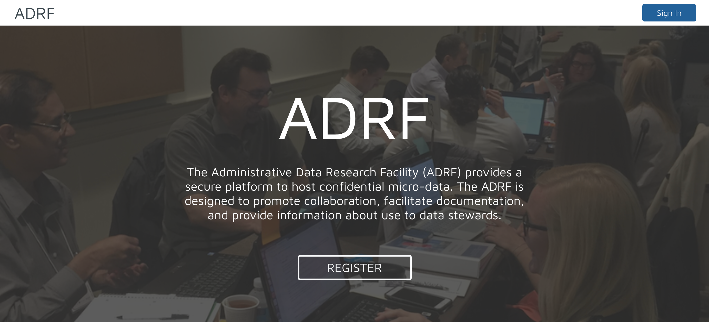
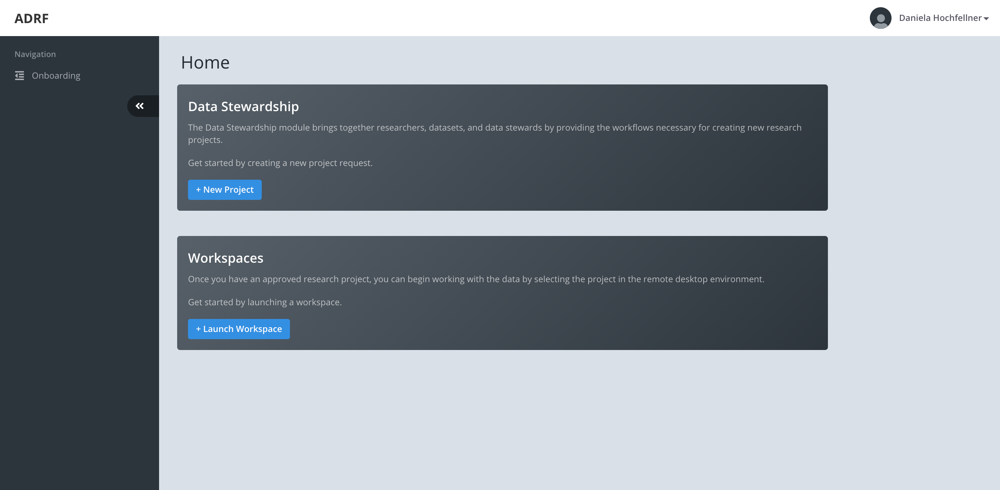

Accessing the ADRF
==================
Once you have your account set up you can sign into the ADRF and access your workspace. There are two ways to access the ADRF. You can log into the web application, where you can access the data explorer, find information on your active projects, and a link to launch your workspace. But you can also access your workspace directly without going through the web application.

Sign in via the Web Application 
-------------------------------
Please go to https://ds.adrf.cloud/ which will bring you to the log in screen as pictured below.

Please click the sign in button and enter your ADRF credentials:

* Username: this field accepts your username for the system or the email address associated with your user account.
* Password: please enter the password you set when creating your account for the ADRF.

Clicking the log in button will bring you to the next step. Now you need to get your access token for the two factor log in.

Please go to your phone and open the app you installed such as Duo Mobile and find the access token. Enter the 6 digit code into the One-Time code field and click log in as pictured below.

.. image:: ../images/onetimecode.png
  :width: 600
  :alt: Enter onetimecode

ADRF Data Stewardship Homepage
^^^^^^^^^^^^^^^^^^^^^^^^^^^^^^

You will be brought to your homepage on the Data Stewardship application. On the left panel you will find the navigation bar.

After your first login, you can find the ADRF onboarding in the navigation bar. In the right-upper corner you can see you account name and clicking on it will lead you to your personal page where you can provide information about yourself. In the middle of the screen you will see two panels. You can submit new research projects in the first one. The second panel will bring you to your workspace in the ADRF.

Sign in via the Direct Link
---------------------------

Once you have your account set up you can also access the ADRF at https://workspace.adrf.cloud. This link will bring you to the log in screen.

.. image:: ../images/adrf.png
  :width: 600
  :alt: image of login screen

Please enter your credentials and click the log in button:

* Username: this field accepts your username for the system or the email address associated with your user account
* Password: please enter the password you set when creating your account for the ADRF.

Clicking the log in button will bring you to the next step. Now you need to get your access token for the two factor log in. Please go to your phone and open the app you installed such as Duo Mobile and find the access token. Enter the 6 digit code into the One-Time code field and click log in as pictured below.

.. image:: ../images/onetimecode.png
  :width: 600
  :alt: Enter onetimecode

In a next step you will be brought to a screen where you can select the project you want to log in for. The application will display all projects in the ADRF you are a member of and are authorized to access data associated with that project and research purpose outlined in the data use agreement you signed.

.. image:: ../images/login.png
  :width: 600
  :alt: image of login

After you select the project and confirm the selection, the system will prepare your workspace. This might take some time. A progress bar will give you an estimate of remaining time to workspace creation and sucessful login.