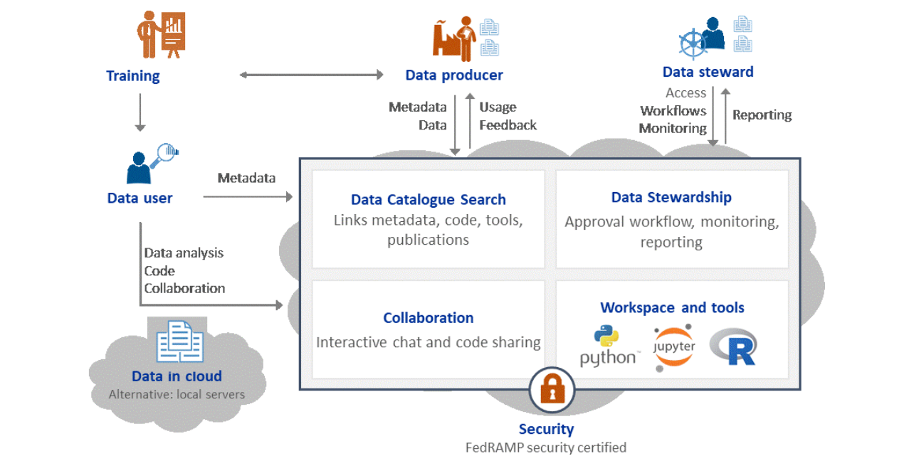

What is the ADRF?
=================
The Administrative Data Research Facility (ADRF) provides a secure platform to host confidential micro-data, serving as a trusted partner for data providers and analysts. It is designed to promote collaboration, facilitate documentation, and provide information about use to data stewards By doing this, the ADRF accelerates data-driven research and policy around human beings and their interactions, for program management, policy development, and scholarly purposes.

The ADRF has achieved :fedrampabout:`FedRAMP <>` Moderate certification, has received Authorization to Operate (AO) from the Census Bureau, and won a national innovation award in the process. It is available on the :fedrampmarketplace:`FedRAMP Marketplace <>` for agency use. The design means that each agency can put its data into its own secure environment within the secure FedRAMP boundaries, and control both access and use.

You can find more information about us and the work we do on our :coleridgeinitiative:`Coleridge Initiative <>` website.
