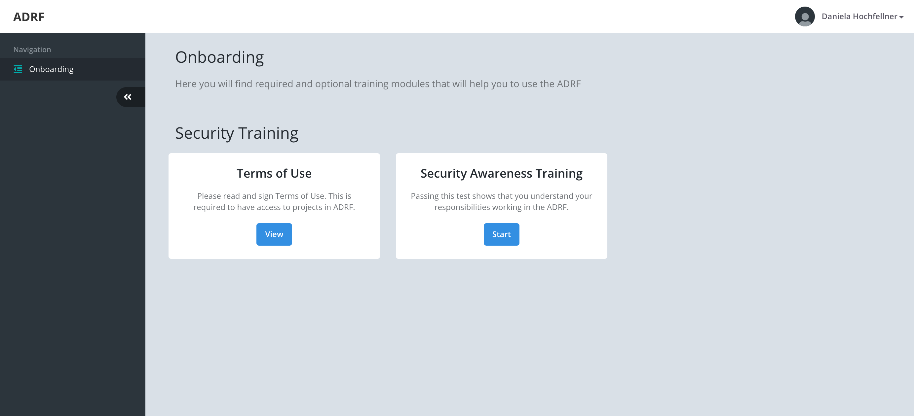

Onboarding
===============

Before gaining access to all functionalities of the ADRF and the Data Stewardship application, every user needs to undergo the onboarding process. You can initiate this by clicking on Onboarding in the navigation bar. This will bring you to the ADRF onboarding module.

There are two components that ADRF users have to complete before accessing the workspace. First, it is important that you familiarize yourself with the terms of use of the ADRF. Second, FedRAMP requires every user to take a security awareness training.

Terms of Use
^^^^^^^^^^^^^
Clicking the view button under terms of use will show you the terms of use of using the ADRF. Please read them carefully. By signing the document you agree with these terms of use and are accountable for any consequences resulting out of non-compliance.

Security Awareness Training
^^^^^^^^^^^^^^^^^^^^^^^^^^^^^^^^^^^
You can start the training by clicking on the start button under Security Awareness Training. There are three videos for you to watch. In order to complete the training successfully you have to take a test after watching the videos. Thus, taking some notes while watching the video can be good.
