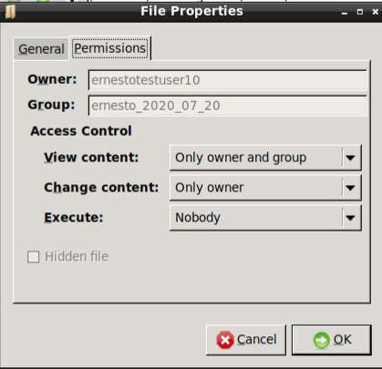

File Permission Error
======================
**Why am I getting a "permission denied" error when trying to save files in a
shared folder?**

By default, when a user creates new files and folders, the Workspace will set their access permission as `read only` for other team members, even though they are created in the shared folder.

A "permission denied" error would occur when saving a file if:
 - The file permission does not allow group members to change content; or
 - The container folder does not allow group members to change content

In order to identify the source of the issue, open the file explorer (see `Explore your Workspace <../usingtheadrf/workspace.html>`_)  and right click on the file or the container folder and click `Properties`. A dialog window will open. Click con the `Permissions` tab.

If the `Change content` is set to `Only owner` or `Nobody`, you have identified the source of the issue.

Next, identify the file's or folder's `Owner` and its `Group` membership on the top of that dialog window.

If the `Group` value is the same as the `Owner`, please ask the owner to follow the above steps and update the `Change content` option to `Anyone`. Otherwise, ask her or him to update the `Change content` option to `Only owner and group`

.. image:: ../images/filepermissions.png
  :width: 550
  :align: center
  :alt: File Permissions
