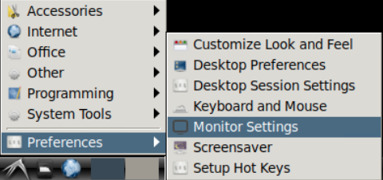
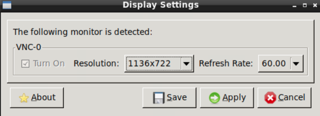

Monitor Settings
================
**How can adjust the workspace resolution to my monitor screen size?**

By default, the ADRF Workspace will auto-scale its screen resolution depending on the size of your window browser at start up time. It is recommended that before you launch the workspace you adjust your browser window size to fit your working monitor screen.

If you need to further customize the screen resolution you can open the *Monitor Settings* located on the start button. Please click Preferences and then go to Monitor Settings.

This will open the Display Settings dialog where you will be able to choose from a set of predefined screen resolutions.

You can choose your preferred resolution and click on *Apply* to see a preview. Please, note that if you click *Save* the ADRF Workspace will not be able to auto-scale in the future. If you don't want to change to the new screen resolution, you can close the config dialog with the *Cancel* button after clicking on *Apply*.
