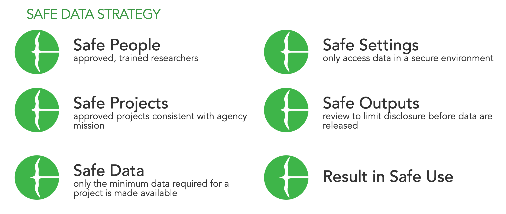

.. ADRF documentation master file, created by
   sphinx-quickstart on Mon Jul  8 12:02:44 2019.
   You can adapt this file completely to your liking, but it should at least
   contain the root `toctree` directive.

ADRF Documentation
======================================
The Administrative Data Research Facility (ADRF) is a secure computing
environment developed by NYU. The goal of the ADRF is to encourage collaboration
while preserving data confidentiality - it is designed following the
`Five Safes framework <https://en.wikipedia.org/wiki/Five_safes>`_.

This guide covers all of the basics users need to know when working in the ADRF. It provides helpful illustrations for common user tasks. Furthermore it outlines best practices of using the system, connecting to the ADRF, accessing and working within ADRF project workspaces, and using common tools in the ADRF environment. You can find more information about us and the work we do on our website :xref:`coleridgeinitiative`

Security Requirements
^^^^^^^^^^^^^^^^^^

.. toctree::
   :maxdepth: 1
   :caption: Security Requirements

   security_requirements/legal
   security_requirements/fedramp

Getting Started
^^^^^^^^^^^^^^^^

All users of the ADRF need to be uniquely identified and need to authenticate when accessing the Facility. Thus, access is implemented through a two factor authentication software. This means you login to your account with unique credentials and password, and a one time password obtained from a authentication app (through an app on your computer or phone). Before you first access you need to set up the protocol according to the following instructions.

.. toctree::
   :maxdepth: 1
   :caption: Getting Started

   getting_started/username
   getting_started/accessing

Using the ADRF
^^^^^^^^^^^^^^^^^^

.. toctree::
   :maxdepth: 1
   :caption: Using the ADRF

   using_the_adrf/jupyterlab
   using_the_adrf/dbeaver

Export of Results
^^^^^^^^^^^^^^^^^^

Any data product or output which is generated using non-public, restricted data has to undergo disclosure review. This is to make sure that no confidential information leaves the ADRF and that all contractual requirements are complied with. In order to allow a fast disclosure review please follow the ADRF documentation guidelines, prepare the output according to the ADRF policies and initiate an export request. After submitting the export request ADRF staff will perform disclosure review. In this review your output will be classified as "safe" or "unsafe" according to standard data protection procedures. Only "safe" output will be released. If your output does not pass disclosure review ADRF staff will talk with you about possibilities to make your research output "safe".

.. toctree::
   :maxdepth: 1
   :caption: Export of Results

   export_of_results/guidelines
   export_of_results/submission

FAQ
^^^^^^^^^^^^^^^^^^

.. toctree::
   :maxdepth: 1
   :caption: FAQ

   faq/password
   faq/support
