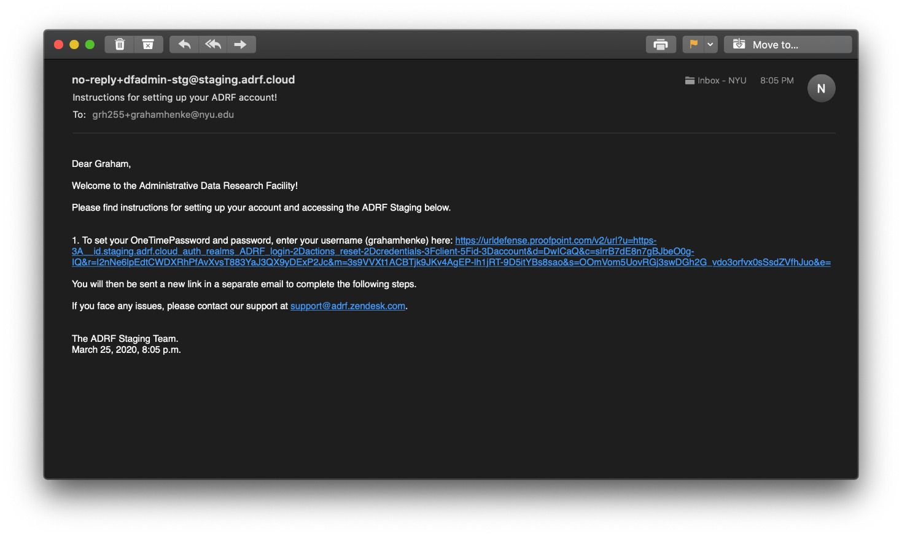
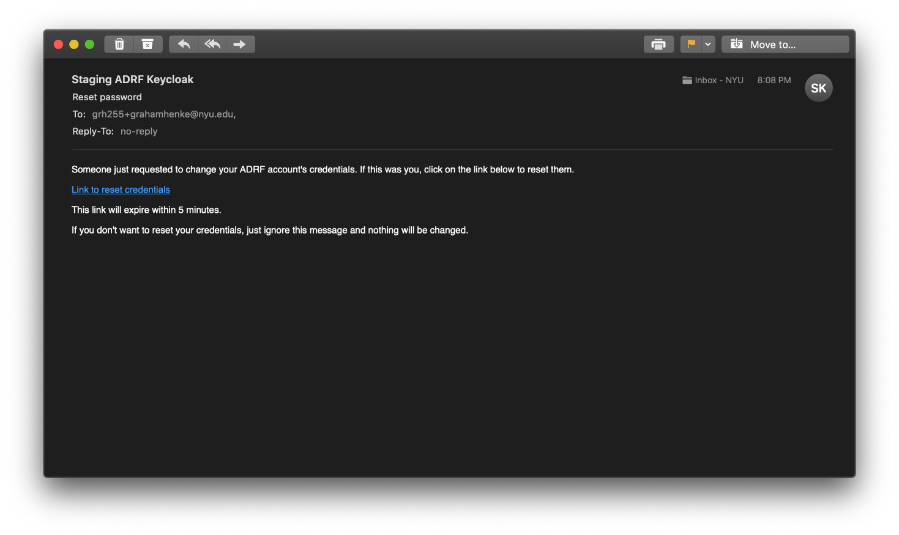
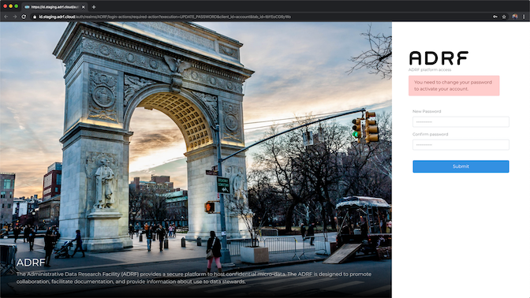
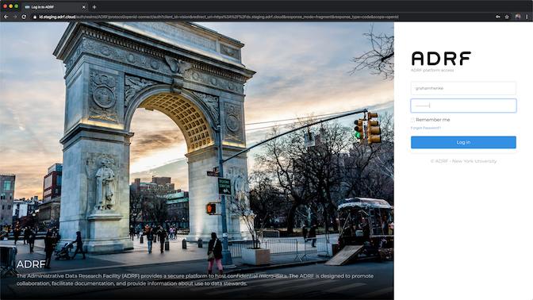
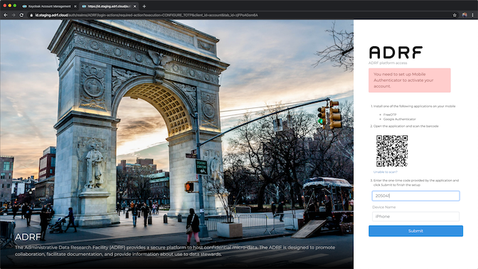
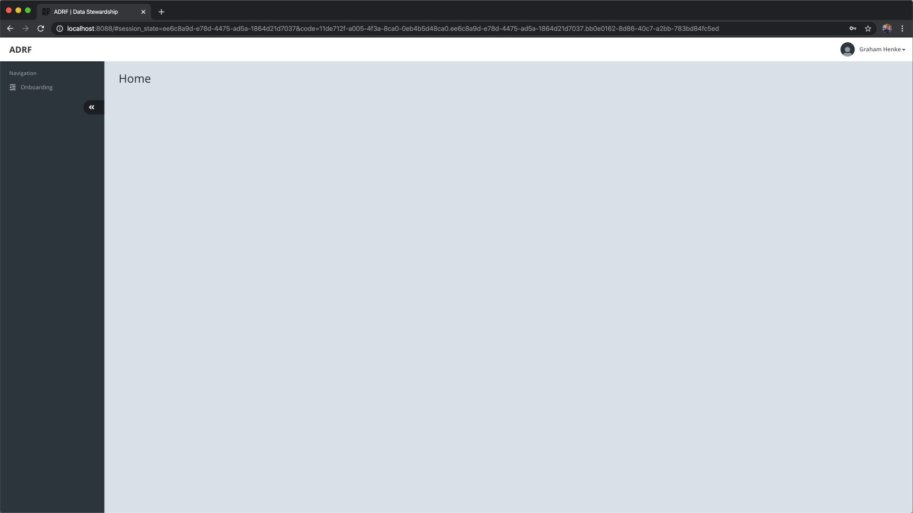

Account Credentials
===================

The ADRF uses two-factor authentication for additional security. You'll need to install an one-time password (OTP) application to your mobile device such as DuoMobile.

Download DuoMobile
^^^^^^^^^^^^^^^^^^
Download DuoMobile to your phone or tablet. There is an app for iPhone and Android. You can find more information here: https://duo.com/product/trusted-users/two-factor-authentication/duo-mobile

Set Your Password
^^^^^^^^^^^^^^^^^

Once your account has been created, you will receive an email from the ADRF team containing your username and a link to set up your account.

When you click the link, you will see a screen that prompts you for your username. Enter the username you found in the email, click the **Submit** button, then close the browser window.

.. image:: ../images/credentials/credentials_2.png
  :width: 600
  :alt: Enter username screen

This process will trigger another email to be sent to you containing a link to reset your credentials. This email is time-sensitive, so please keep an eye on your inbox and make sure to check your spam folder if you don't see it.

When you open this link, you will be brought to a screen where you will enter a password for your account.

Password Policy
---------------

Any password you set must meet the following requirements, based on NIST password complexity guidance:

* 12 Characters
* 1 upper case letter
* 1 lower case letter
* 1 number
* 1 special character
* Cannot be the same as any of your previous 24 passwords

Enter this same password twice and click the submit button.

Once you've successfully entered a password, you will be brought to a Keycloak page that shows your basic account information. Please click the **Sign Out** button. In the next step, you will set up your mobile device and sign in to the ADRF.

.. image:: ../images/credentials/credentials_5.png
  :width: 600
  :alt: Keycloak page

Configure OTP
^^^^^^^^^^^^^

In your web browser, go to https://ds.adrf.cloud. You will be brought to the ADRF home page. Click the **Sign In** button in the upper-right corner. On the next screen, enter your username and password and then click **Log In**.

You will then be shown a QR code. Open Duo Mobile on your mobile device and tap the plus icon in the upper-right corner. You may have to grant the application access to your camera first. Now you should see a view from your camera in the app. Point the camera at the QR code on your screen. This will add an account in Duo Mobile and you will see a 6-digit code in the app.

The code on your phone has a 30 second timer, but don't worry. Once the time elapses, a new code will be generated. Just make sure that when you hit the submit button, the code you entered is the same code that is currently being shown on your phone.

Enter the code you see on your phone into the first text box on your computer. The Device Name field is optional, so you can leave it blank, or enter a name for your device if you'd like. Click the **Submit** button to continue.

The next screen you see will be blank the only option available is onboarding.

Congratulations! You now have fully set up your credentials and are logged in to the ADRF. The next section describes what to do in the onboarding modules.
