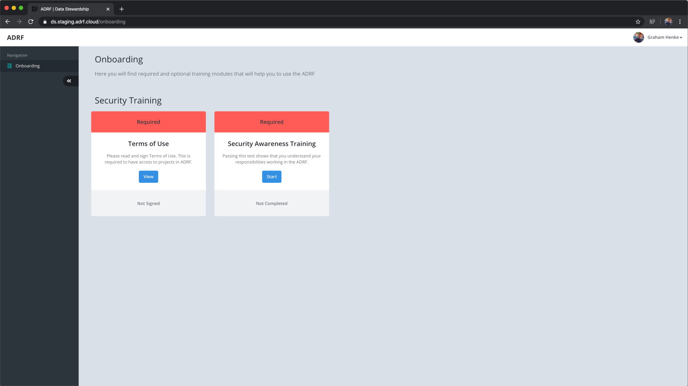
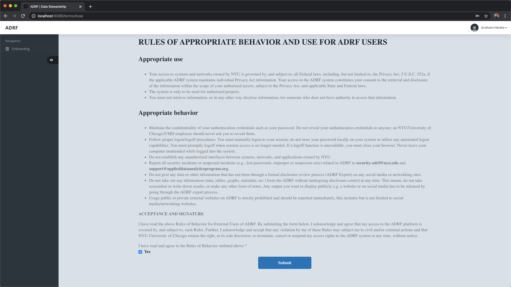
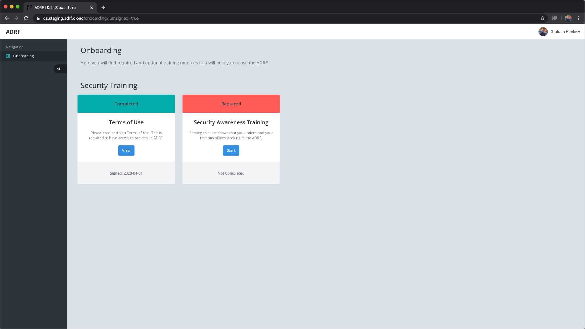
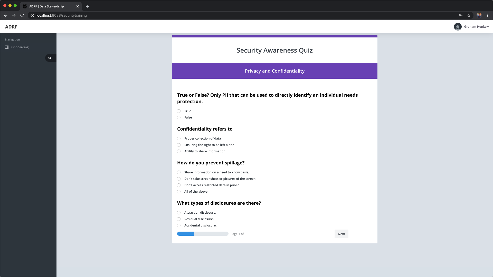

Onboarding Modules
==================

Terms of Use
^^^^^^^^^^^^

If you have not done so already, click the Onboarding link in the left navigation column. On the Terms of Use panel, click the **View** button.

Please take some time to read through and understand the Terms of Use. Once you are finished, click the checkbox and click **Submit**.

Security Awareness Training
^^^^^^^^^^^^^^^^^^^^^^^^^^^

Now click the **Start** button in the Security Awareness Training panel.

This page will present you with a series of videos to watch, followed by a short 10 question quiz. The total length of all 3 videos is about 30 minutes and the quiz should only take you a few minutes. You must score an 8 out of 10 on the quiz to pass, but don't worry. You can retake the quiz until you achieve a passing score.

Once this is complete, you should now see more options in the navigation column. Congratulations! You are now fully onboarded to the ADRF! Please feel free to use the Explorer to see what datasets are available as well as related publication information, or complete your `profile page <profile.html>`_.
