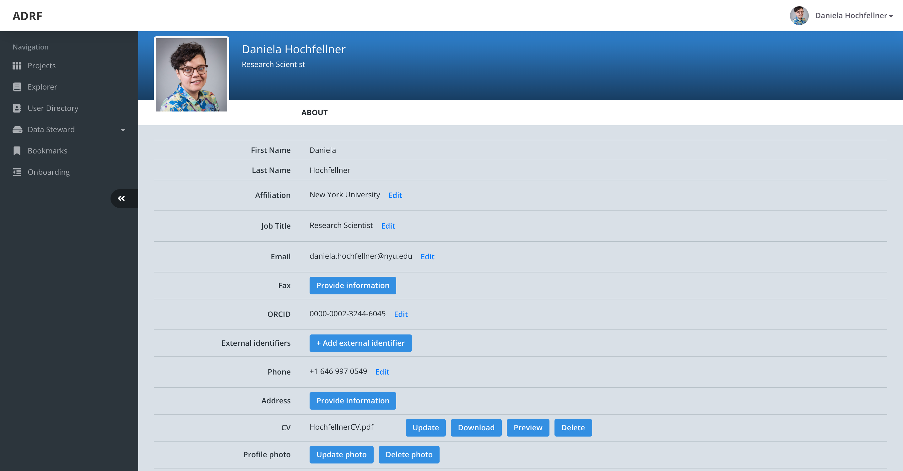

Profile Page
=================
If you click on your username at the upper-right corner you will be redirected to your personal profile page. This page is for you to provide information about yourself as pictured below.

The information gathered during account creation is already pre-filled, but additional information is missing. Please take some time and update the missing field by clicking provide information. Depending on the dataset you are requesting/using, some of these fields may be required. Furthermore, you have the opportunity to upload a current CV or resume and a profile picture.

Personal identifiable information that you provide to ADRF is kept confidential and is only processed within the application. ADRF uses this information only for administration and reporting purposes.
