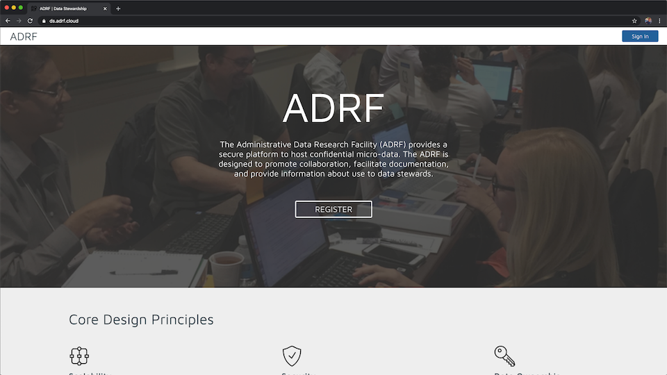

Account Registration
====================
This guide will help you to set up your account and provide you with everything you need to know to get started in the ADRF.

In order to create an account, you will need to submit some basic information for our team to review. Please visit https://ds.adrf.cloud, and click the **Register** button in the page banner.

On the next screen, please fill in the requested information and click the **Sign Up** button. Our team will then review your registration. If no other information is needed, you will receive an email within 1 business day which will contain a link and instructions for creating your account credentials.

.. image:: ../images/registration.png
  :width: 600
  :alt: Registration screen for the ADRF application

While you wait, please feel free to read through our documentation to learn more about the ADRF. If you want to get a head start, you can go ahead and `read our Terms of Use policy and watch the Security Training <../reference/sectrain.html>`_ videos in the reference section.
