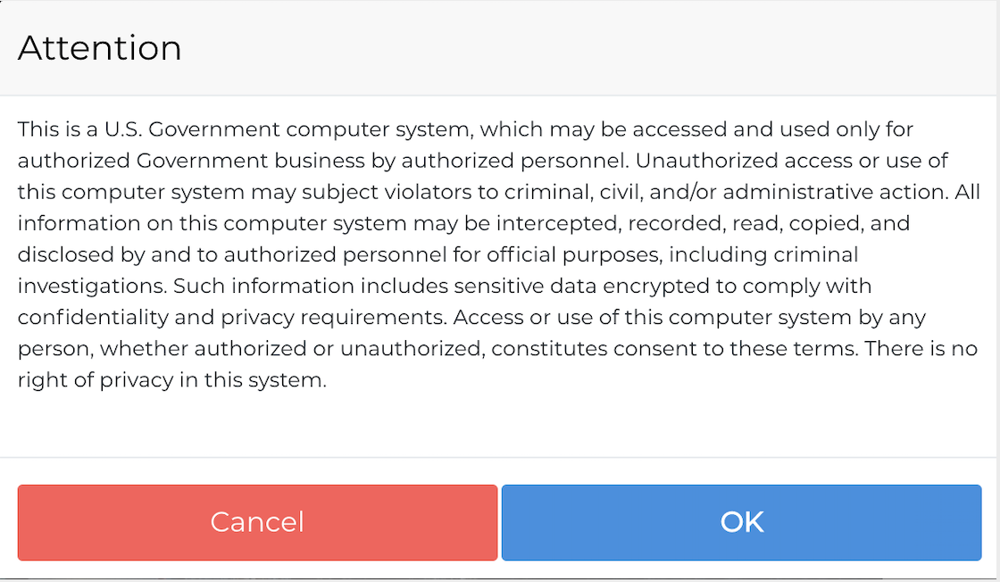

Terms of Use
==================

The ADRF is a secure system that hosts data from various government agancies in the United States. Thus. users have to comply with the Terms of Use when working in the ADRF. Every time upon login you will see a reminder. Before confirming please make sure that you kn ow what your respinsibilites are. 

1. Appropriate Use
^^^^^^^^^^^^^^^^^^^

Your access to systems and networks owned by NYU is governed by, and subject to, all Federal laws, including, but not limited to, the Privacy Act, 5 U.S.C. 552a, if the applicable ADRF system maintains individual Privacy Act information. Your access to the ADRF system constitutes your consent to the retrieval and disclosure of the information within the scope of your authorized access, subject to the Privacy Act, and applicable State and Federal laws. This means: 

* The system is only to be used for authorized projects.
* You must not retrieve information, or in any other way disclose information, for someone who does not have authority to access that information.

2. Appropriate Behavior
^^^^^^^^^^^^^^^^^^^^^^^^

Please keep these rules in mind when working in the ADRF: 

* Maintain the confidentiality of your authentication credentials such as your password. Do not reveal your authentication credentials to anyone; ADRF staff should never ask you to reveal them.
* Follow proper logon/logoff procedures. You must manually logon to your session; do not store your password locally on your system or utilize any automated logon capabilities. You must promptly logoff when session access is no longer needed. If a logoff function is unavailable, you must close your browser. Never leave your computer unattended while logged into the system.
* Do not establish any unauthorized interfaces between systems, networks, and applications owned by NYU.
Report all security incidents or suspected incidents (e.g., lost passwords, improper or suspicious acts) related to ADRF to security-adrf@nyu.edu and support@applieddataanalyticsprogram.org.
* Do not post any data or other information that has not been through a formal disclosure review process (ADRF Export) on any social media or networking sites.
* Do not take out any information (data, tables, graphs, metadata, etc.) from the ADRF without undergoing disclosure control at any time. This means, do not take screenshot or write down results, or make any other form of notes. Any output you want to display publicly e.g. a website or on social media has to be released by going through the ADRF export process.
* Usage of public or private external websites on ADRF is strictly prohibited and should be reported immediately, this includes but is not limited to social media/networking websites.

In order to access the ADRF every unser needs to ahere to these rules and sign the protocol on our website :termsuse:`Link to Terms of Use <>`.