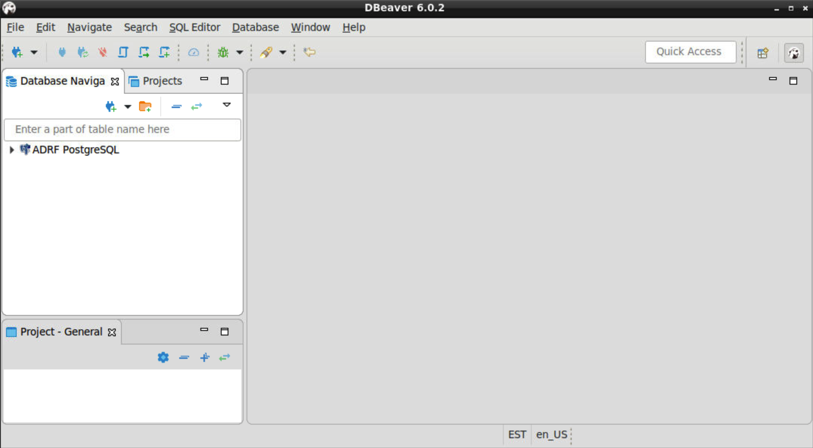
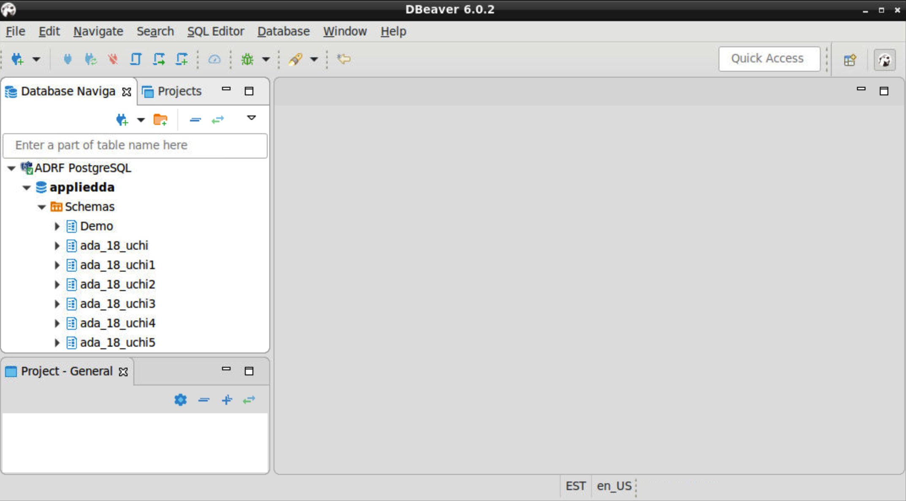
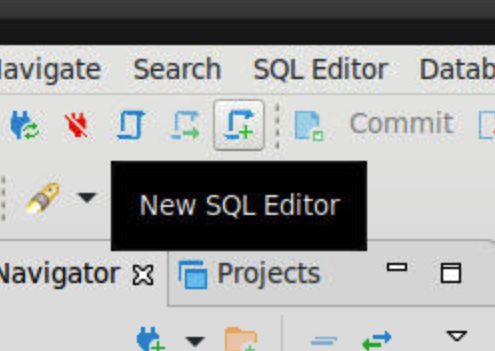
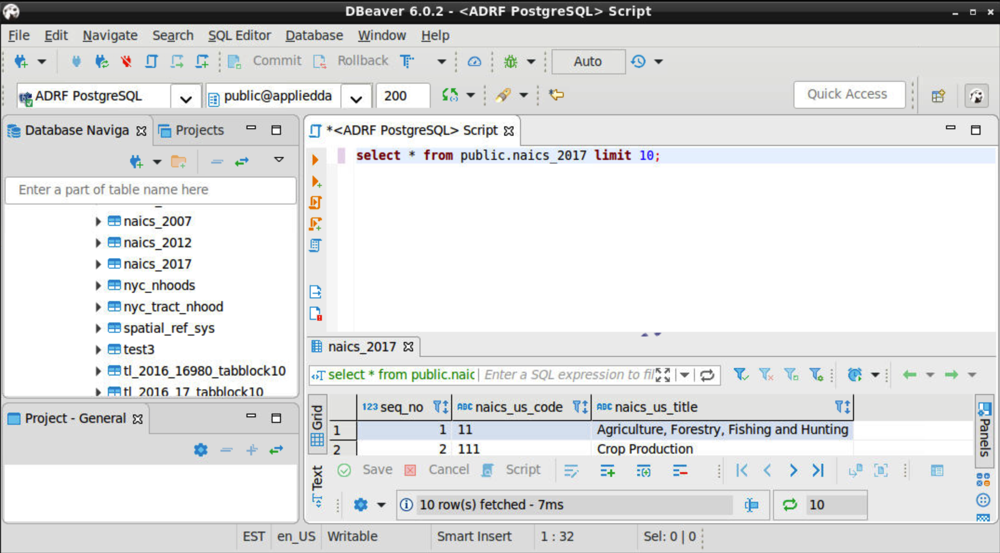

DBeaver
=======
DBeaver is free and open source universal database tool for developers and
database administrators. In the ADRF, it is primarily used as an exploratory
tool for datasets.

To get started, double-click the DBeaver icon on the Desktop.

.. image:: ../images/dbeaver.png
  :width: 100
  :alt: DBeaver

When DBeaver finishes loading, you should see a screen like the one below.

Exploring Tables
^^^^^^^^^^^^^^^^

DBeaver in the ADRF is already pre-configured and connected to a database which
has the data you have access to for your project, as well as a schema which can
be used by your team for creating your own tables.

Using the **Database Navigator** on the left, expand the **ADRF PostgreSQL**
connection, then **appliedda**, which is the name of the database. Expand
**Schemas**, and you'll see a list of all schemas in the database. Some of these
you will not have access to, but you should find schemas that contain your data,
and also a schema with the same name as your project. You will have
write access to this schema so that you can create your own tables.

Additionally, there is a **public** schema which contains publicly available data
which you may find useful.

Running Queries
^^^^^^^^^^^^^^^

To run a query, click the **New SQL Editor** button in the toolbar

This will open up a new text editor on the right where you can enter and execute
SQL queries. To start, try querying data from a public schema as shown below.
Enter ``select * from public.naics_2017 limit 10;`` and click the orange play
button. Results from your query will be displayed in the bottom panel.

Writing to a table
^^^^^^^^^^^^^^^^^^

You have write access to a schema with the same name as your project, so make
sure to specify the schema when writing your query. For example, if you are on
project ``ada_my_project``, your query should look like the following:
``select * into ada_my_project.my_table_name from ...``
