Software in the ADRF
====================
The workspace provides you with software for your analytical research. By default data in the ADRF is ingested into databases. You can access these databases through DBeaver or Jupyter. Thus, these are the main tools supported for every project. ADRF can make different software available on request.

JupyterLab
^^^^^^^^^^
JupyterLab is a web application that allows you to create and share documents
that contain live code, equations, visualizations and explanatory text. Uses
include: data cleaning and transformation, numerical simulation, statistical
modeling, machine learning and much more.

To get started, double-click the Jupyter icon on the Desktop, which looks like the icon below.

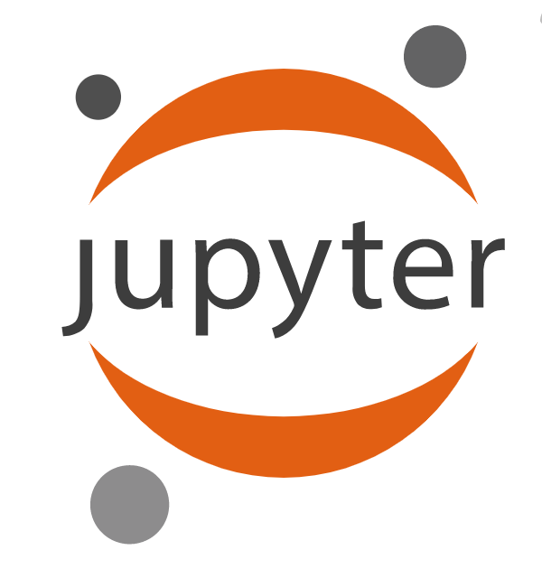

Directory Structure
"""""""""""""""""""

**Home Directory**

By default, JupyterLab will open with your home folder as the default location
to save notebooks that you create. Any notebooks or files that you create in
this location will only be visible and accessible to you. Your screen should
look similar to the following.

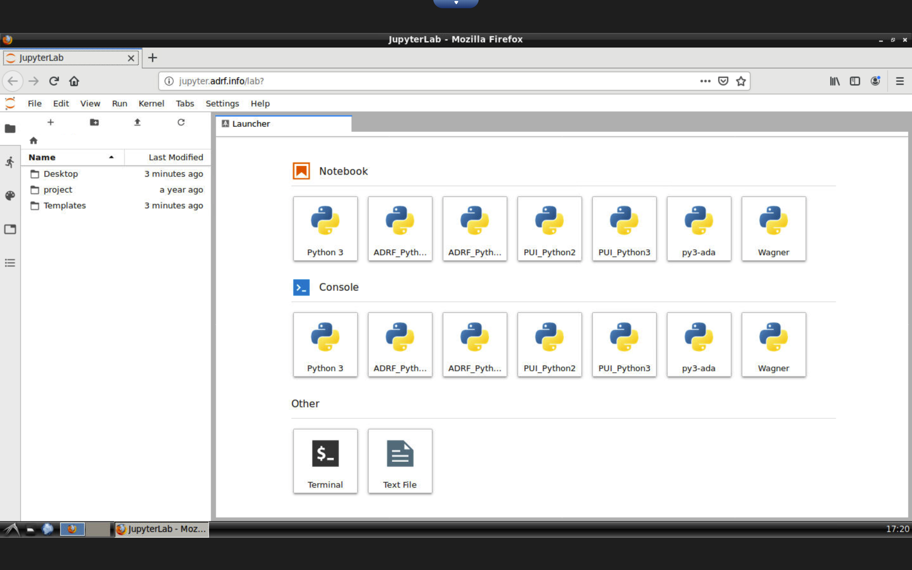

*Note the house icon in the upper-left corner of the file navigator. This is what you should click to get back to the home directory.*

**Project Directory**

Double-clicking the ``project`` folder will take you into the shared folder
of your team. Any notebooks or files saved here will be accessible to anyone on
your project.

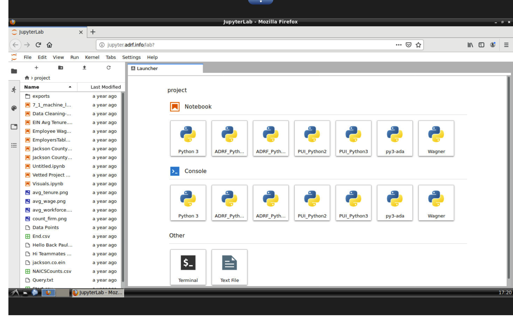

Running a notebook
""""""""""""""""""

To start a new notebook, simply click one of the kernel options under
**Notebook** from the main Launcher panel (we recommend ADRF_Python3). You can
also use the file menu by selecting File > New > Notebook, then choosing which
kernel you'd like to use.

You can now write and run Python code. Try entering some code into the first
cell and running it using the Play button or **Shift + Return** on your keyboard.

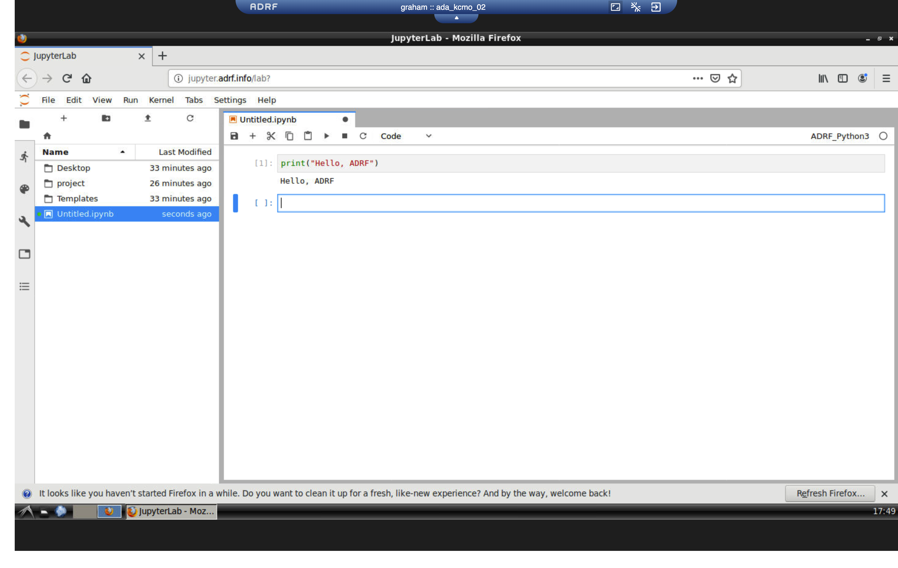

To learn more about how to use JupyterLab, please visit their documentation page
where they have provided extensive, easy to follow guides at
https://jupyterlab.readthedocs.io/en/stable/

Jupyter Lab also offers you an R kernel for your analysis. If you prefer to use R instead
of Python for your analysis you can do this by switching to the R kernel (see separate documentation for R).

Switching kernels
"""""""""""""""""
The ADRF provides a number of different kernels that can be used in Jupyter Lab. Each kernel
contains different packages, and sometimes different versions of Python, and even different language support such as R.
We recommend using **py3_ada**, as it contains most common analytical packages for Python, but you may wish to use another.

Switching kernels is easy. In the upper-right corner of the notebook, you will see the name of your kernel. Simply click
the name of the kernel, and you will be presented with a dropdown menu of all available kernels. Choose the kernel you
would like and press the **Select** button.

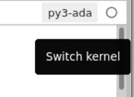

Connecting to the database
""""""""""""""""""""""""""
You can connect directly to the database in Jupyter. You need to load the required packages first, but then you will be able to connect to the database as displayed in the picture below.

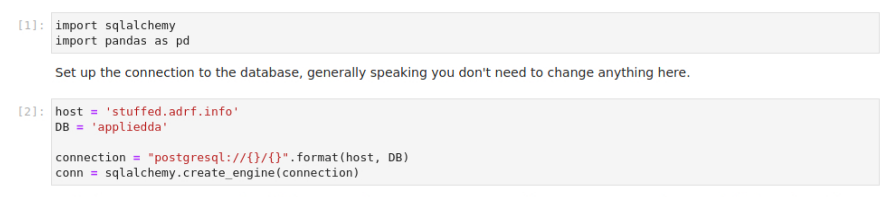

Package Upload
""""""""""""""
The ADRF has the most popular Python packages installed. In case you need additional packages please download the packages on your home computer and send them via email to support@coleridgeinitiative.org. We will install them for you as soon as possible. Unfortunately you can't install them yourself as the ADRF doesn't allow any connection to the internet.

DBeaver
^^^^^^^
DBeaver is free and open source universal database tool for developers and
database administrators. In the ADRF, it is primarily used as an exploratory
tool for datasets.

To get started, double-click the DBeaver icon on the Desktop, which looks like the icon below.

.. image:: ../images/dbeaver.png
  :width: 100
  :alt: DBeaver

When DBeaver finishes loading, you should see a screen like the one below.

.. image:: ../images/dbeaver-default.png
  :width: 600
  :alt: DBeaver Default

Exploring Tables
""""""""""""""""

DBeaver in the ADRF is already pre-configured and connected to a database which
has the data you have access to for your project, as well as a schema which can
be used by your team for creating your own tables.

Using the **Database Navigator** on the left, expand the **ADRF PostgreSQL**
connection, then **appliedda**, which is the name of the database. Expand
**Schemas**, and you'll see a list of all schemas in the database. Some of these
you will not have access to, but you should find schemas that contain your data,
and also a schema with the same name as your project. You will have
write access to this schema so that you can create your own tables.

Additionally, there is a **public** schema which contains publicly available data
which you may find useful.

.. image:: ../images/dbeaver-appliedda.png
  :width: 600
  :alt: Applied DA Database

Running Queries
"""""""""""""""

To run a query, click the **New SQL Editor** button in the toolbar

.. image:: ../images/dbeaver-new-sql-editor.png
  :width: 300
  :alt: New SQL Editor button

This will open up a new text editor on the right where you can enter and execute
SQL queries. To start, try querying data from a public schema as shown below.
Enter ``select * from public.naics_2017 limit 10;`` and click the orange play
button. Results from your query will be displayed in the bottom panel.

.. image:: ../images/dbeaver-query.png
  :width: 600
  :alt: Running a query

Writing to a table
""""""""""""""""""

You have write access to a schema with the same name as your project, so make
sure to specify the schema when writing your query. For example, if you are on
project ``ada_my_project``, your query should look like the following:
``select * into ada_my_project.my_table_name from ...``

Mattermost
^^^^^^^^^^
Mattermost is a flexible, open source messaging platform that enables secure
team collaboration, similar to Slack. It is provided in the ADRF to allow you to talk to your project team without having that conversation outside of the ADRF to protect the confidentiality of the the data. You can use it if you want to share information with your collaborators that is sensitive in nature.

To get started, double-click the Mattermost icon on the Desktop, which looks like the icon below.

.. image:: ../images/mattermost-logo.png
  :width: 100
  :alt: Mattermost

Initial Login
"""""""""""""

When you open Mattermost for the first time, you should see a message like the
one below.

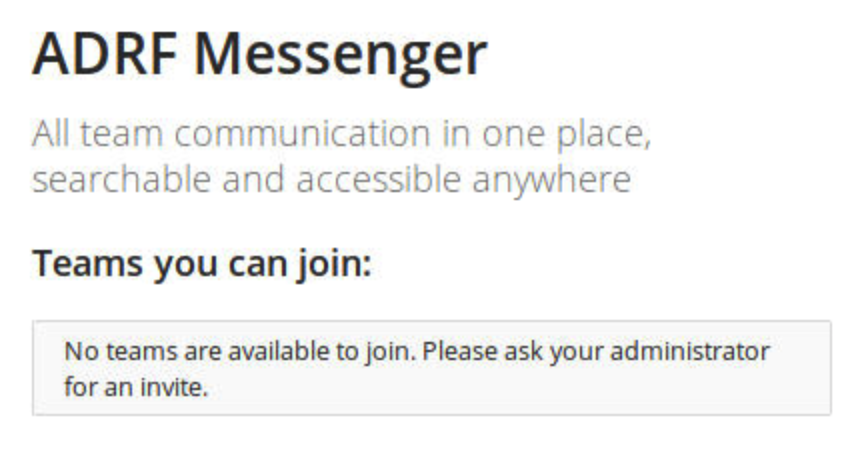

In the ADRF, Mattermost will log you in automatically, but the first time requires
a synchronization process to run in order to add you to the appropriate teams.
Please allow up to 15 minutes for this to process, then check back later.
Afterwards you'll see a screen like below.

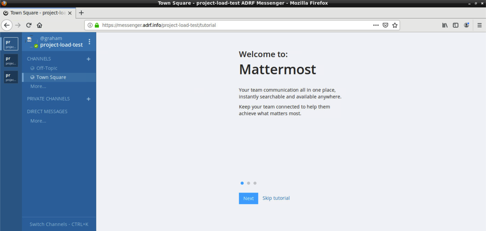

For more information on how to use Mattermost, refer to the documentation at
https://docs.mattermost.com/guides/user.html

R
^^^^^^^^^^

Python and SQL are ADRF's default data analytic tools that are accessible for every user. The ADRF however has R Studio and an R kernel for Jupyter available on request. If you need R for your research project please get in touch with us and we can install it for your project.

Working with R Kernel
"""""""""""""""""""""

If your project has access to an R Kernel you can use Jupyter to run R code. Follow the examples under section Jupyter if you want to know how to run a notebook. The only difference when you want to use Jupyter to run R code is that you need to switch the Kernel to R.

Working with R Studio
"""""""""""""""""""""

If you have requested to use R Studio on your workspace you will see an R Studio icon on the desktop. Please double click the item and R Studio will open. Then you can proceed using R Studio the same way you are used to work with on your home computer.

Connecting to the database
""""""""""""""""""""""""""
You can connect directly to the database using R. You need to load the required packages first, but then you will be able to connect to the database as displayed in the picture below.

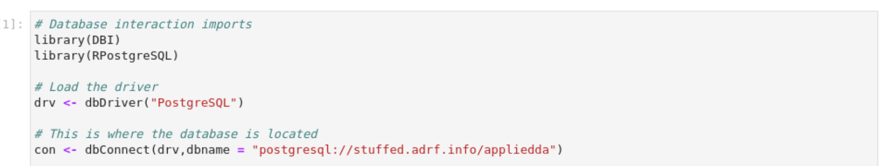

Installing R Packages
"""""""""""""""""""""

This applies to you in case you are using specifc user written packages in R Studio or R Kernel. As the ADRF is not connected to the internet you can't download packages you need when you work on the ADRF. Instead you have to send us the packages (support@coleridgeinitiative.org) you need and we will install them for you. Please note that this takes some time on our side as we have to scan all external files for security vulnerabilities before we can install them. It will take about 2 weeks until a requested package is installed. We advise you to plan your research early and let us know your required packages as soon as possible. The first time you log in to R you can check what packages are installed by running following code. To see what package are installed you can run the command ``installed.packages()``.

Stata
^^^^^^^^^^

Stata is not installed on the ADRF by default as it requires you to purchase a license. If you need Stata for your data analysis work please get in touch with us and we will reach out with information on licensing fees. You will need to buy a license for every user on your project that wants to work with Stata.

If you have Stata available in your project space you will see a Stata icon on the desktop. You can double click and use Stata as you would on your home computer. Please keep in mind that the ADRF stores data in a PostgreSQL database. You won't find flat files in your folder.

Connecting to the database
""""""""""""""""""""""""""

Thus, to load data you need to connect to the database. In Stata, from the File menu, go to Import, and then click on ODBC data source.

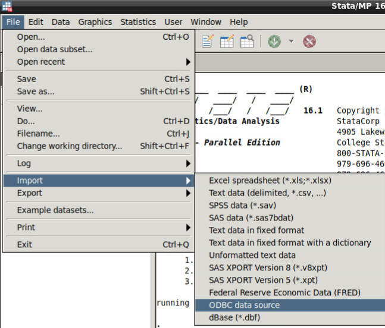

In the dialog window that pops up, click on postgresql – PostgreSQL to view all tables available. Select the table of your data schema that you want to load. Make sure you check the option “Do not quote SQL table name”, otherwise the data won't load properly.  Click Submit to test it or OK to close the dialog, as pictured below.

.. image:: ../images/stataimport.png
  :width: 600
  :alt: Displays how you open data from database

Installing Stata ados
"""""""""""""""""""""

This applies to you in case you are using specifc user written ado files in Stata. As the ADRF is not connected to the internet you can't download ado files you need when you work on the ADRF. Instead you have to send us the ado (support@coleridgeinitiative.org) and we will upload the adofile into your project folder. Please note that this takes some time on our side as we have to scan all external files for security vulnerabilities before we can load them. It will take about 1 week until an ado file is transferred. We advise you to plan your research early and send us your required ados as soon as possible. The first time you log in to Stata you can check if a ado file is installed by typing ``which "name of ado file"``.

When you send us ados these will be saved in your project folder. This means that you have to tell Stata the path to the files so Stata can find them. You can specify the path using the command ``adopath++"path to adofile"``.  Now you can run the command.

GitLab
^^^^^^
The ADRF provides GitLab which is a git-based repository that you can use within the secure environment. It is intended primarily to support the export process. But if you are familiar with git, you can use it to keep track of your project changes.

To get started double-click the GitLab icon on the Desktop, which looks like the icon below.

.. image:: ../images/gitlab-logo.png
  :width: 100
  :alt: GitLab

Your GitLab credentials are the same as you ADRF one. For login, make sure you use the *ADRF* tab and not the *Standard* one, as showed in the next image.

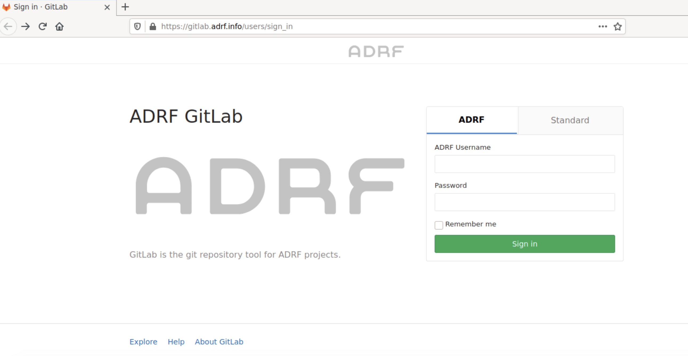

You will notice that ADRF created 2 git repositories for every project. The one ending in *_export* will be used for the export workflow. You can use the one ending with *_repository* as you need it.

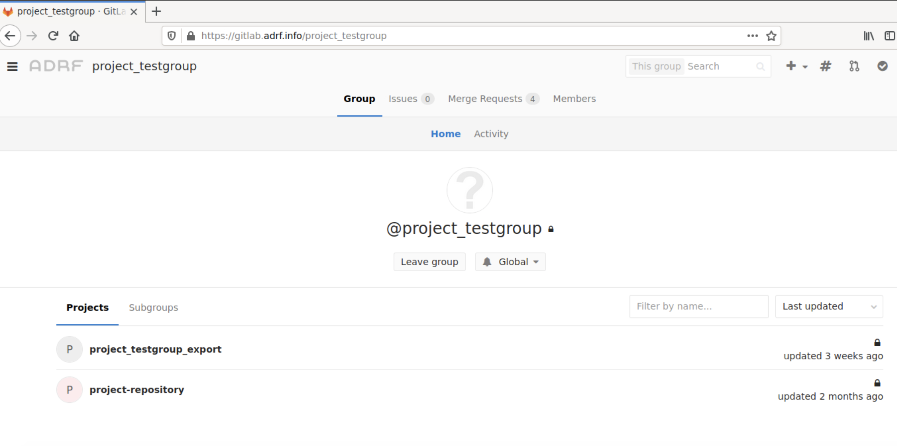

Libre Office
^^^^^^^^^^^^
The ADRF also offers you open source software to process words, and generate spreadsheets in the ADRF. Instead of exporting your result and writing your paper at home you can do this directly in the ADRF and export the final product. You can access Libre Office by clicking on the arrow in the left lower corner of the screen and then selecting **Office** in the panel.

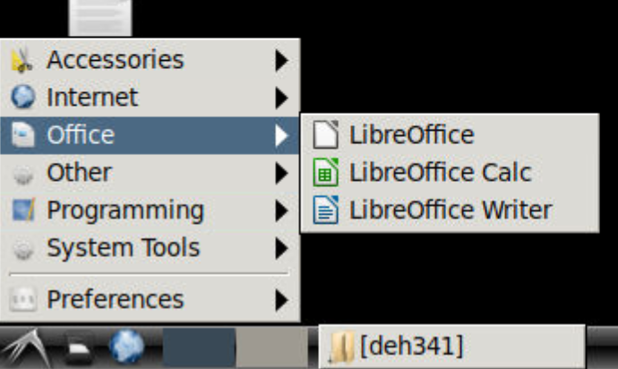
