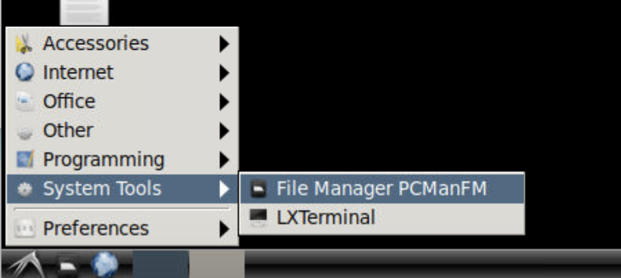

Explore your Workspace
^^^^^^^^^^^^^^^^^^^^^^

Once you logged in successfully you will be able to see your workspace and interact with the applications provided for you on the workspace. The workspace will look similar to the picture below.

.. image:: ../images/workspace.png
  :width: 600
  :alt: Screenshot of workspace

You can find shortcodes to open the software provided for you. In order for members of a research group or team to effectively collaborate and share code, project workspaces are created for each project team. Specifically, this is a shared folder in the ADRF environment to which only the members of the research team have access. On the lower left corner you can open the file manager and navigate to your home folder on the ADRF.

Only you have access to your `home` folder. You will also see a `Projects` folder which is your workspace for the specific project you are working on. While you are able to organize your project however you wish, there are 3 folders that are created by default to assist in project organization:

* export: The export folder is used at the end of your project lifecycle for placing your research outputs into for export review.
* shared: The shared folder is accessible to all members of your team and the recommended location for placing data and code that are to be used by the entire group.
* user: Inside the user folder, each individual team member has a folder with which only they have access to
