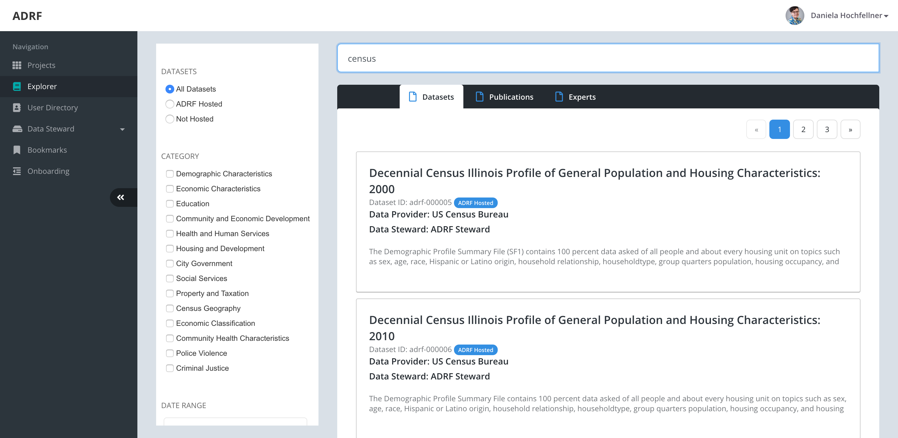
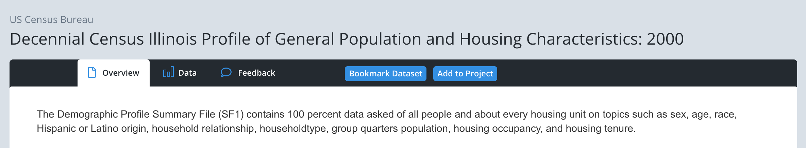

Data Explorer
=============

The data explorer gives you the opportunity to find out more about datasets that are hosted in the ADRF. You can search the catalog in various different ways, such as searching for specific data sources, or keywords and fields.

Once you have found a dataset that you are interested in, you can click on the dataset and you can see metadata that is associated with each dataset. You will see an overview tab which provides you with a brief description of the dataset and key metadata. In addition, you can look up papers that have been published with the dataset. The data tab will show you a preview of the content of the dataset in case the data is publicly available. For restricted data this tab shows documentation that ADRF can show publicly. You can use the feedback tab to add comments to each dataset. For instance, if you have worked with the data before, you probably have some expert knowledge to share. Please provide this, as it will help users that have never worked with the data.

