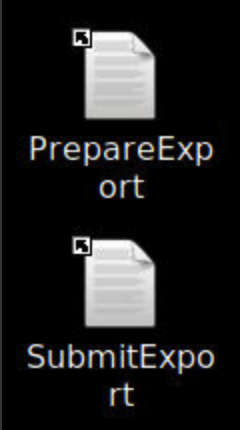
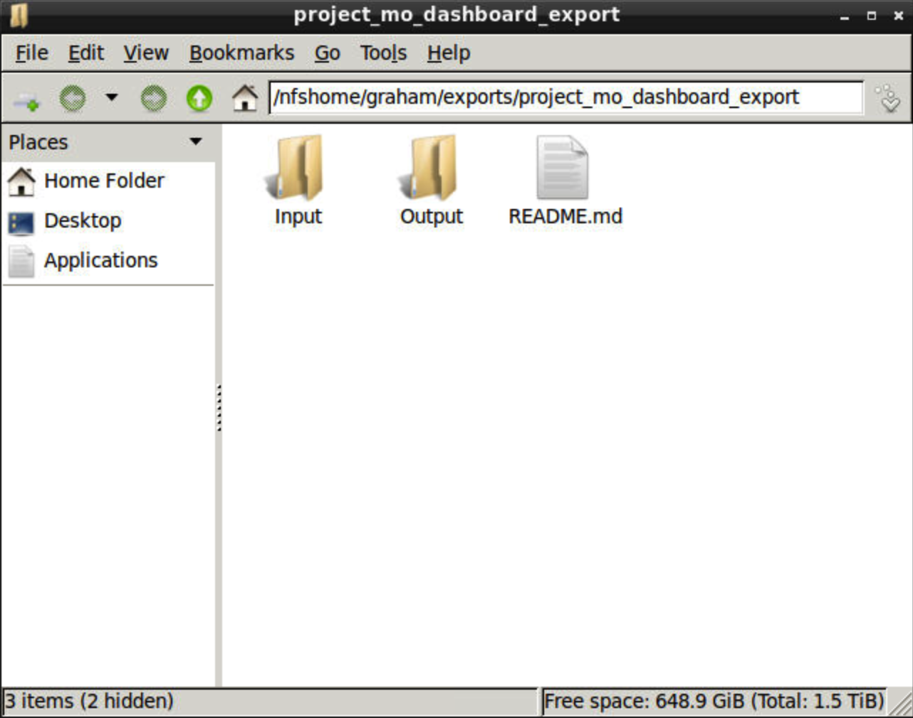
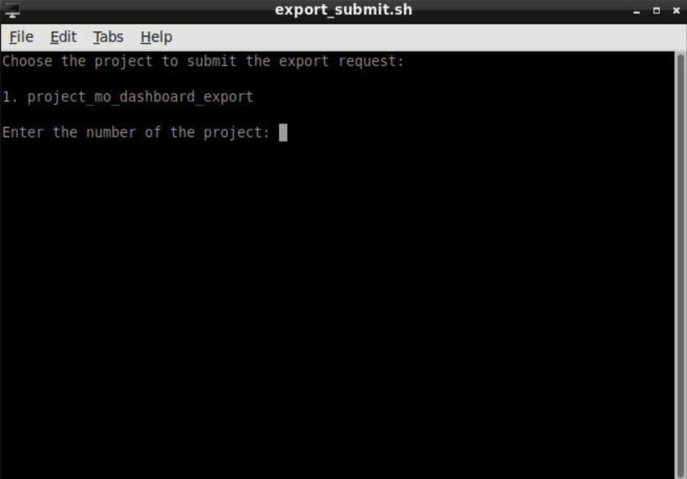
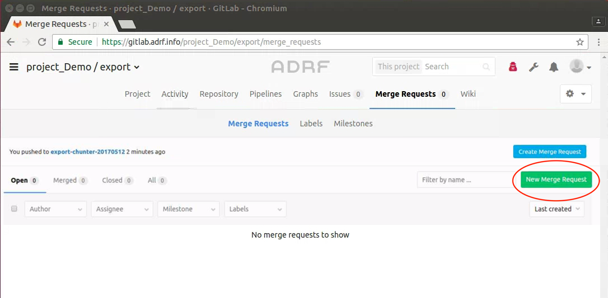
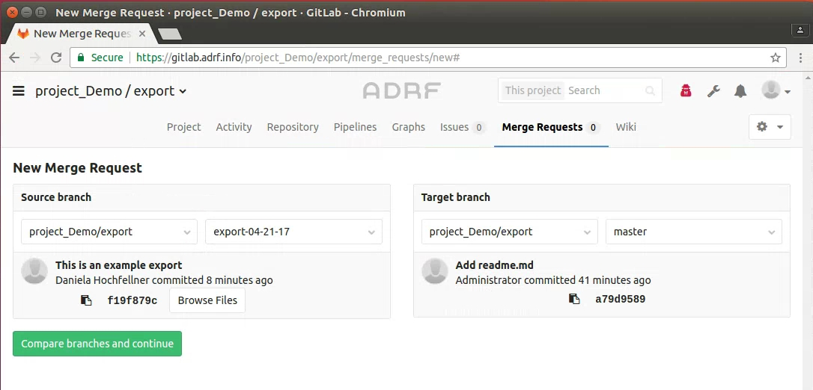
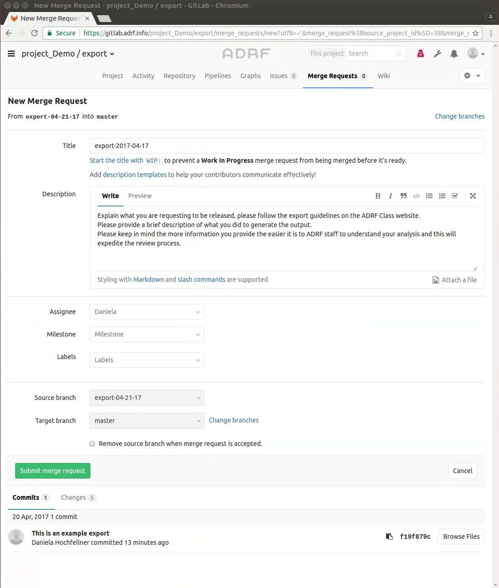

Exporting Results
=================
You have been granted access to a computing environment with sensitive data. Thus it is important that you adhere to the terms of use you signed and keep data confidential. FedRamp regulations state that disclosure of data should not happen at any time during your research project.

Disclosure of data refers to every output you take out of the ADRF without going through the export process. This includes but is not limited to taking handwritten notes, taking screenshots or pictures, talking to somebody who is not on your project about specifics in the data, and working in a public space where external people might see your screen.

This does not mean that you can't get any research output from the ADRF, however to comply with FedRamp security protocols, we have a process in place which every user has to undergo if they want to have results for presentations or papers. The following section describes the ADRF export control and provides guidelines on how to prepare exports so they will meet the disclosure proofing requirements.

Export Guidelines
-----------------

Disclosure review means that ADRF staff will manually look at all your data output/study results which may be time consuming. Please limit the volume of your output requests for two reasons. One is that each additional release adds disclosure risk and limits subsequent releases. The other is that although we will try to release tables as quickly as possible, large requests are very time consuming and slow to review. To allow a quicker turnaround we ask you to follow the ADRF Export Guidelines:

Documentation
^^^^^^^^^^^^^
Please structure your input and output folders to enable ADRF Staff to find information quickly if needed. For example you can have one folder in which you store all the code, one folder for graphs, one folder for data, etc. If you have multiple files of code which depend on each other please name them in a way that is is visible which files runs first, second, etc. (1_DataPrep.py, 2_SummaryStats.py, 3_MultivarAnalyses.py).

Think about meaningful names to allow inference on the content of the file. This also applies to variables. For instance, if you are calculating outflows it is better to name the variable outflows instead of var1. Every file of code should have a header including a description of the content of the file, a timestamp, and what kind of data manipulation takes place. The more detailed your documentation the easier it is for ADRF staff to follow your study during disclosure control.

Code documentation is helpful for disclosure reviews. The better the documentation the faster the turnaround of export requests. In particular when you aggregate data files. In this case we require documentation on the level of aggregation and during which step in the program the aggregation took place (specify in code).

Required Information
^^^^^^^^^^^^^^^^^^^^
Please denote the unit of analysis clearly in your programs (individuals, regions, etc.). During disclosure review cell sizes represented with less than 10 individuals, unless otherwise designated, will be suppressed. Thus for each cell in the table (or the source data underlying any graph representation), provide the counts of each entity (n) and the percentage (p) of any value accounted for by the top 4 (k) entities. Some helpful hints are provided in the checklist below.

For each statistic you want to be released we need the count of entities who are underlying this statistic. In case you generate aggregates we need the number of entities in each aggregate. If the aggregate is a ratio, the number of valid cases has to be computed for each subgroup of the aggregate (e.g. number of men in state X and number of women in state X in addition to the ratio of women in state X). For descriptive statistics: always report the total number of observations as an input. Do not include unit record data in programming code and logs.

Checklist for Output
^^^^^^^^^^^^^^^^^^^^

**1. Tabular Output**

* General Rule: No cell should have fewer than 10 observations unless otherwise designated.

* Aggregation: If a table contains sensitive cells, a method you can use to protect these cells is to aggregate (collapse) those categories (see the Jupyter Notebook for examples).

* Suppression: When sensitive cells still occur and no further grouping is appropriate, the procedure is to suppress the cell (remove its value), then suppress other cells to stop the first cell from being determined. This later stage is called secondary suppression

* Secondary Suppression: Secondary suppression is the suppression of other cells or marginal totals in the table so that the suppressed cell cannot be recalculated. There are no universal guidelines for applying secondary suppression, except that there has to be enough secondary suppression to ensure that primary suppressed values cannot be re-identified.

* Percentages: You may calculate percentages, proportions, and ratios using the unweighted counts. However, suppress percentages, proportions, or ratios where either, or both, of the counts used to calculate the percentage, proportion, or ratio have been suppressed. Round percentages calculated from unweighted counts to 1 decimal places. Do not report 0 or 100%.

* Medians: Do not report medians. You can calculate a fuzzy median by averaging the 45 and 55 percentile.

* Maxima and minima: Suppress maximum and minimum values in general. Where a maximum or minimum value is not identifying, it may be considered for release

**2. Regression Output**

* Regression output does not usually have confidentiality issues. However, you need to check that pieces of output are not based on small counts. Only report the necessary coefficients and list the control variables
* For regression coefficients of dummy variables, you must report counts of both the 0s and 1s for each dummy variable. These counts must be greater than or equal to 10 unless otherwise specified
* Be mindful that scatterplots based on regressions must only have aggregated points otherwise the scatterplot will not pass disclosure review

**3. Graphs**

* Type A: Graphs produced from aggregated data, or tables that have been confidentialised (eg frequency histograms, bar charts of magnitudes). Provide the underlying tables
* Type B: Graphs produced directly from the unit record data, but aggregated in the process by the software (eg frequency histograms, kernel density plots). Provide the underlying tables
* Type C: Graphs produced directly from the unit record data, and displaying unit record values (eg scatterplots, residual plots). For this type of graph to be released, you need to ensure that individuals cannot be recognised and that values can only be estimated with a high level of uncertainty- Further processing can include, but is not restricted to: cutting off the tails of a distribution, removing outliers, creating a density plot, jittering the actual values, and removing or modifying axis values
* Type D: Graphs produced from the results of modelling or derivation that use the unit record data (eg regression curves) – Release only if the values cannot be used to find original data values

Submit an Export Request
------------------------

:Note: Before following these instructions, you will need to have previously logged into Gitlab once before. Afterwards, please allow up to 15 minutes before submitting a request as it takes time for Gitlab to be synchronized with the system.

Please read the export guidelines carefully and make sure your code and the material (files, tables, graphs, etc.) which you want to export is in compliance with it. Once the material you want to export is ready you can initiate an export request. There are three steps, detailed below, which you will need to complete to submit an export request:

1. Prepare your export request
2. Submit your export request
3. Create a merge request on GitLab for your export request.

You will find two icons on your desktop to initiate the request.

Prepare Export
^^^^^^^^^^^^^^

Start your export by clicking on the  "PrepareExport" icon on your desktop. This will open following terminal window:

.. image:: ../images/prepare.png
  :width: 400
  :alt: Terminal Window Prepare Export

The prepare export script clones your export repository (if necessary) and generates a new branch for the export which is named "export-username-YYYYMMDDHHMMSS".

The export folder connected to the repo is located in your home directory. You will find two subfolders "input" and "output" in the export folder.

Now you can drag and drop the files you want to export into the corresponding folders:

* Input folder: please save all files you used to create the files you are asking to export. This includes all code files and any other documentation you want to provide with your results. If your exports are based off work you did in a Jupyter notebook, please include a copy of the Jupyter notebook showing all code outputs in your input folder.
* Export folder: all files that you want to export go in this folder. Any format is allowed. Please remember that if you request graphs we need a csv or txt file showing the numbers behind the graph. If you want to export a Juypter notebook, please clear any data in the notebook before exporting.

When you are done with copying the files needed for the export you can close the windows and start the second part of the export request, the actual submission.

Submit Export
^^^^^^^^^^^^^

After preparing the export you need to click on the icon "SubmitExport" which will open following terminal window for you:

Enter the number associated with the project you want to submit (this will always be 1). Then you will be asked to enter your password for GitLab, which is your ADRF password.

After entering your GitLab account info your export request will be pushed to the respective project export repository on Gitlab. The export request is labeled with "export-username-date".

Create Merge Request
^^^^^^^^^^^^^^^^^^^^

In order to complete your export request and notify ADRF you need to submit a merge request through GitLab. The following screenshots will walk you through the submission of a merge request.

**1. Login to Gitlab**

Once you navigate to Gitlab, you will be required to login, which is the same as your ADRF login information.

**2. Create a New Merge Request**

GitLab will open directly on the merge request tab. Please always click the green "New Merge Request", (**not** the blue button which says Create Merge Request).

**3. Select the Correct Branches**

Now you have to select the source and target branch.

* The source branch field on the left shows the name of your export project repository. The right field shows the export you submitted. If you click on it it will open a drop down menu. Please select the most recent submission you want to export ("export-username-date").
* The target branch field on the left should display the same project repository as in the source branch field. Master should be selected on the right field.

Please make sure that you selected the correct branches before you click "Compare branches and Continue".

**4. Fill out the Form and Submit the Request**

Now you can complete the export form and click "Submit Merge Request":

* **Title**: Please fill in the title with "export-username-date"
* **Description**: Please provide us with a description of what you are exporting. The more details you provide the easier it is to understand what you did in your analyses. Think about the information someone who is not familiar with your project needs to know to understand your research.
* **Assignee/Milestones/Labels**: You can leave these fields as they are
* **Source branch**: Should be the branch that you submitted for export ("export-username-date")
* **Target branch**: Please make sure that master is selected.

Please do not close the merge request. If you close the merge request the ADRF staff will not be notified that there is an export request in line to be disclosure proofed.

Download Approved Export
^^^^^^^^^^^^^^^^^^^^^^^^

Now the export has been submitted and is in line for disclosure review. During the disclosure review, ADRF staff makes sure that all the output you want to export does not re-identify a single data entity and is prepared according to the export guidelines. The ADRF staff will be in touch with you via Slack and/or email and send you a download link to your email address associated with your ADRF account if your export is approved. If your export is not approved, ADRF staff will reach out to you and let you know what you need to change to get your export approved. The export request will be protected and you can not make any changes to this export request. If you need more output you need to submit a new export request.

We will try to make export turnaround as fast as possible, but in order to do that, it will be necessary to keep the number of the export requests at a minimum.
