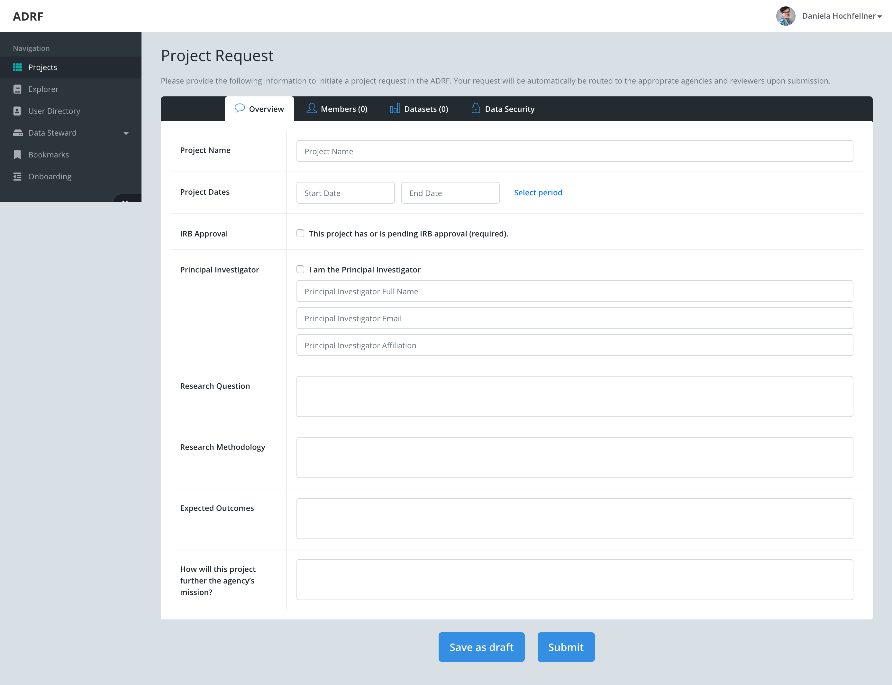
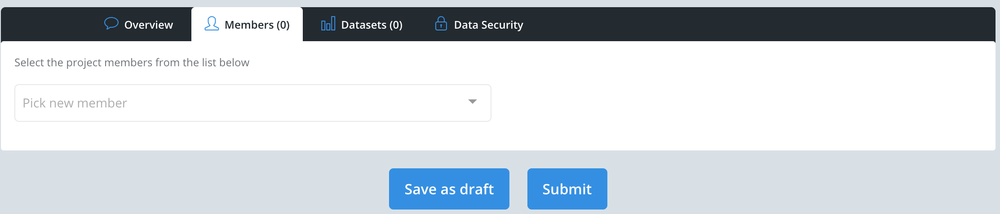
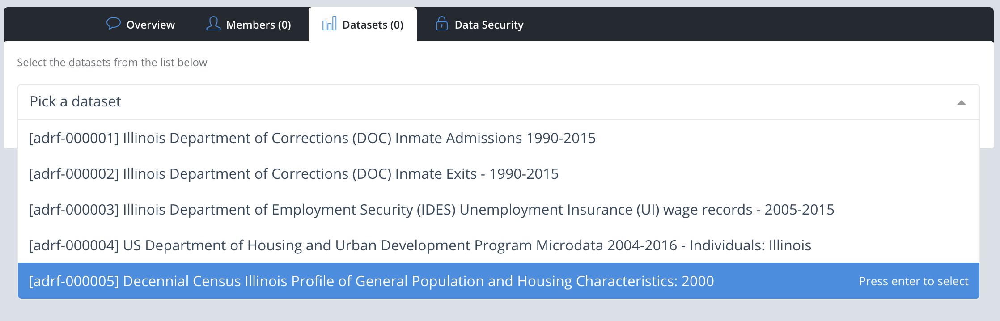
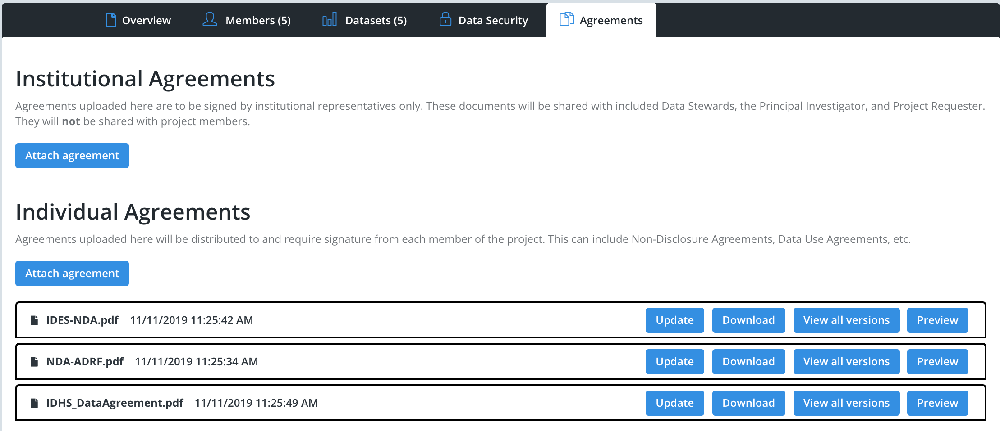

Projects
=================
In order for members of a research group or team to effectively collaborate and share code, workspaces are created for each project. Specifically, this is a shared folder in the ADRF to which only the members of the research team have access.

Once in the ADRF, clicking on the `Files` icon on the left-hand side will open a file browser. From here, you will see a `Projects` folder which contains all project workspaces. Inside the `Projects` folder, you will have access to any project workspaces you are a member of.

While you are able to organize your project however you wish, there are 3 folders that are created by default to assist in project organization:

export: The export folder is used at the end of your project lifecycle for placing your research outputs into for export review.
shared: The shared folder is accessible to all members of your team and the recommended location for placing data and code that are to be used by the entire group.
user: Inside the user folder, each individual team member has a folder with which only they have access to

How to request a Project
-------------------------

If you are new to the ADRF and wnat to set up a project the application provides an easy way for you to do this. If you log into https://ds.adrf.cloud/ you can see a project request button. If you click on this it will open up a project request. This is a form that you can use to fill in all the information that the ADRF needs to set up a project for you in the computing environment. The sections below will walk you through filling out a project request. You din't have to complete this right away. You can save drafts and edit the request until you are ready for submission.

Project Request - Overview
^^^^^^^^^^^^^^^^^^^^^^^^^

The form might change slightly depending on the data you request but will look very similar to this. 

Please provide us with the name of your project. This will become the name of your project folder in the computing environment. In addition we need to know how long you are planning to work on this project. Your access to the ADRF will be revoked automatically at the end of your project. Please don't plan too conservatively, but also don't ask for a project duration of more than 5 years. In case your research is using data on human subjects and requires an IRB review please let us know. We can only give you access to data if you either have an IRB or started the review process. In. cae you are the Principal Investigator on the project you can check the PI box and the application will automatically fill in your information. If you are completing the request for somebidy else you can enter the information for the PI. 

All projects are specific to a research question. Most of the data that are available in the ADRF are tied to a specific research field. Thus, data access is only possible if your study is in that respective field. We ask you to give us a short description of your research agenda, methods used and expected outcomes. This will help the data steward whon reviews the application making a decision if you are eleigible to gain data access. Finally, to fullfill an agencies legel mandate your research project has to provide benefits to the agency that will provide the data for your project. You may indicate these benefits in the final field.

Project Request - Add Collaborators
^^^^^^^^^^^^^^^^^^^^^^^^^

After filling out the overview tab you can proceed to the next tab and add all collaborators that will be working with you in the ADRF. You can only add members that are registered in the ADRF. If you would like to add a colaborator who is not already a registered user please ask them to sign up for the ADRF using this link: https://ds.adrf.cloud/. Once all your collaborators have accounts you will be able to select them from the drop down menu or search by name.

Project Request - Add Collaborators
^^^^^^^^^^^^^^^^^^^^^^^^^

The next tab give you the option to add datasets to your project. You can search data by name. Another way to add a dataset is using the explore to find datasets and then add them to a project by clicking the respectrive button shown in the data explorer. 

Project Request - Sumission and Review
^^^^^^^^^^^^^^^^^^^^^^^^^
Once you've filled out all the information you can click the submit button. Your request will be send to the data stewards who are responsible for the data you selected. The data steward will review your request and make a decision if you are qualified to access the data. You will get a notification when this decision is being made. This might take a couple of weeks depending on the internal review processes of each data providing agency. After you submitted the request you can't make any changes to the request anymore. Unless the data steward asks you to make changes. 

Project Request - Agreements and Non Disclosure
^^^^^^^^^^^^^^^^^^^^^^^^^
After your project has been granted an inital approval the data steward will upload all agreements and non-disclosure policies that need to be signed. You can see an new tab on the project request named agreements. In case your institution needs to sign an agreement you will find this under institutional agreements. Non-disclosure and Confidentiality forms are typically sign by each of the project members and thus show up under individual agreements. All project members can download the paperwork that needs to be signed from the application, sign it and upload the signed copies into to application again. In case you have comments for the data steward you have the possibility to provide these via the application too. 

Project Request - Final Approval
^^^^^^^^^^^^^^^^^^^^^^^^^
When all users have signed the agreements and the data steward confirmed that all requirements for data access are met a project space willbe created on the ADRF. This space can be accessed by all members indicated on the project request. 